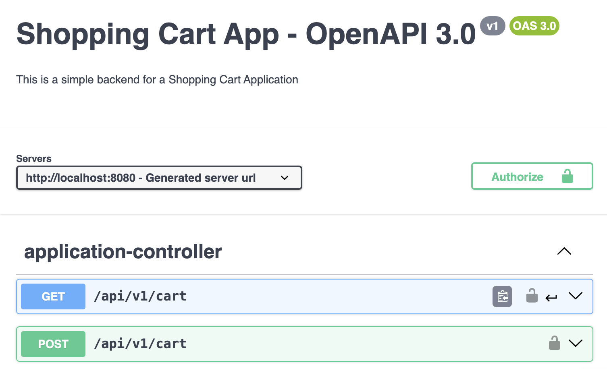

# ShoppingCart Backend API

The ShoppingCart API is a Spring Boot-based backend application designed to handle shopping cart operations with enhanced security and performance features.



## Features

### Functional Highlights

- **API Endpoints**: Implements RESTful endpoints for managing shopping cart operations.
    - `GET /api/v1/cart`: Retrieve cart items.
    - `POST /api/v1/cart`: Update cart items.

- **Architecture**: Utilizes the Controller-Service-Repository pattern for clean separation of concerns and efficient request handling.

- **Conditional Reads**: Supports ETag-based conditional GET requests to minimize data transfer and improve cache utilization.

- **Authentication**: Integrates basic authentication using Spring Security with BCrypt for password encoding and custom error handling.

- **Database Integration**: Uses Hibernate and JPA for ORM with PostgreSQL, automating schema generation and offering robust transaction management.

- **Logging and Exception Handling**: Leverages Log4J for logging and implements centralized exception handling via Spring's `@ControllerAdvice`.


### Non-Functional Highlights

- **Swagger Documentation**: Includes OpenAPI specifications for clear API documentation.

- **JSON Schema Validation**: Ensures the integrity of incoming data using JSON Schema validations for request payloads.

## Setup and Installation

### Prerequisites

- JDK 17
- Docker
- PostgreSQL

### Running with Docker (Recommended)

1. Clone the repository:
    ```bash
	 git clone https://github.com/gouthamhusky/shoppingcart.git  
	 cd shoppingcart  
	 ```
2. Build and run the Docker containers:
   ```bash  
   docker-compose up --build  
   ```  
3. Access the API at `http://localhost:8080`.


> OR


1. Pull the Docker image from Docker Hub:
     ``` bash  
     docker pull gouthamoncloud9/shoppingcart-springboot:latest  
     ```

2. Start a PostgreSQL server on port 5432:
   ```bash
     docker run -d \  
       --name my_postgres_db \  
       -e POSTGRES_USER=myuser \  
       -e POSTGRES_PASSWORD=mypass \  
       -e POSTGRES_DB=mydatabase \  
       -p 5432:5432 \  
       postgres:13  
   ```

3. Run the Docker container:
   ```bash
     docker run -d \                                                         
       --name my_springboot_app \  
       --link my_postgres_db:db \  
       -p 8080:8080 \  
       -e SPRING_DATASOURCE_URL=jdbc:postgresql://db:5432/mydatabase \  
       -e SPRING_DATASOURCE_USERNAME=myuser \  
       -e SPRING_DATASOURCE_PASSWORD=mypass \  
       gouthamoncloud9/shoppingcart-springboot:latest  
    ```  

4. Access the API at `http://localhost:8080`.


### Running without Docker (Alternative)

1. Clone the repository:
   ``` bash
     git clone https://github.com/gouthamhusky/shoppingcart.git  
     cd shoppingcart  
    ```

2. Start a PostgreSQL server on port 5432

3. Build and run the application:
   ```bash
   ./mvnw spring-boot:run  
   ```

4. Access the API at `http://localhost:8080`.

## Swagger OAS Documentation

The API Swagger documentation is available at `http://localhost:8080/swagger-ui.html`.